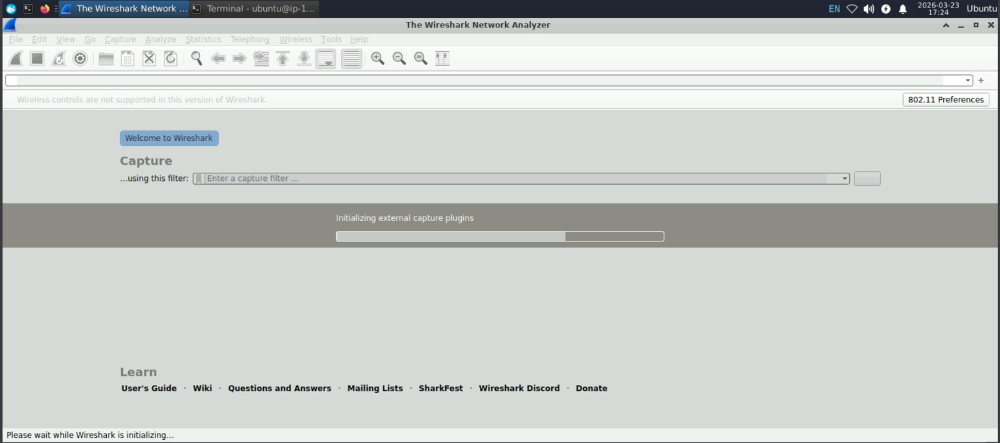
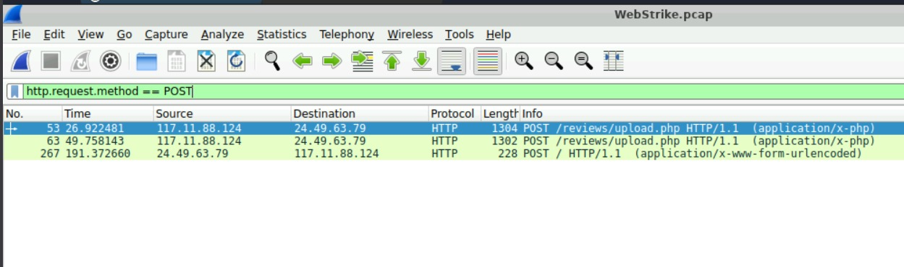
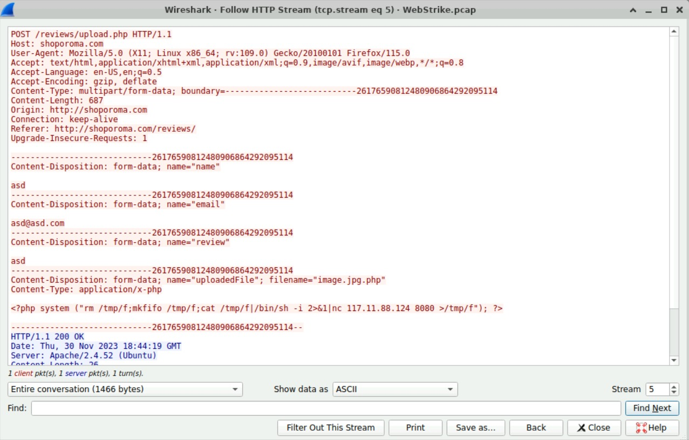
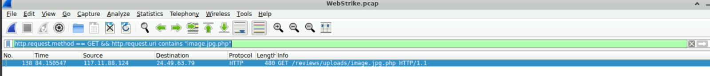
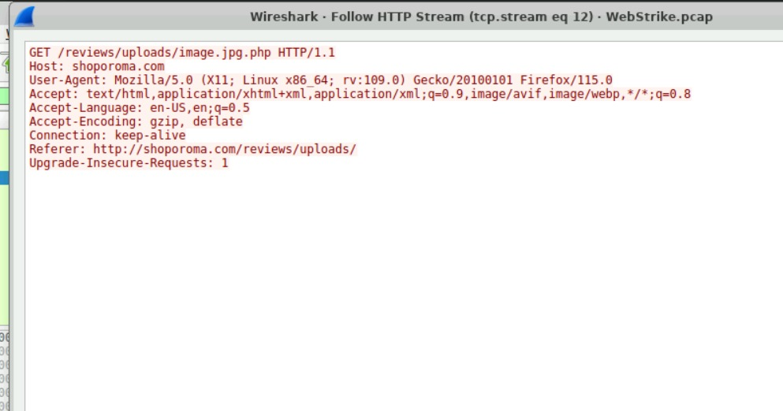
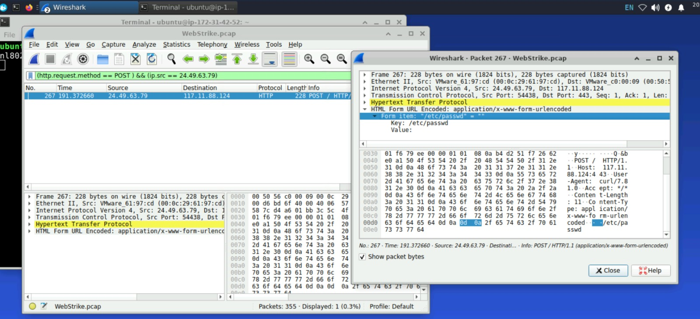

# Lab Name — WebStrike

**Platform:** CyberDefenders  
**Category:** Network Forensics  

---

## Scenario
A suspicious file was identified on a company web server, raising alarms within 
the intranet. The Development team flagged the anomaly, suspecting potential 
malicious activity. To address the issue, the network team captured critical 
network traffic and prepared a PCAP file for review.
Your task is to analyze the provided PCAP file to uncover how the file appeared 
and determine the extent of any unauthorized activity.

---

## Tools Used
- Wireshark
  
- iplocation.net

---

## Walkthrough

### Q1 — Identifying the geographical origin of the attack facilitates the 
implementation of geo-blocking measures and the analysis of threat intelligence. 
From which city did the attack originate?

**What I did:** The first step was to open the PCAP file in Wireshark, as it 
contains the full network traffic — essentially a complete timeline of the 
attacker's activity.

**What I found:** In any attack, the attacker is logically the source of the 
first SYN packet. This revealed the attacker's IP address: **117.11.88.124**. 
By looking it up on iplocation.net, I was able to pinpoint the exact location 
along with additional threat intelligence information.

**Answer:** Tianjin

---

### Q2 — Knowing the attacker's User-Agent assists in creating robust filtering 
rules. What's the attacker's Full User-Agent?

**What I did:** The User-Agent identifies the browser and operating system used 
by a machine. Knowing this is useful for building precise blocking rules. I 
applied the **http** filter in Wireshark to isolate only HTTP requests and 
locate the User-Agent field.

**What I found:** By inspecting an HTTP packet, I analyzed the different layers 
of the network model. The application layer, using the HTTP protocol, contained 
several details about the request, including the User-Agent field.

**Answer:** Mozilla/5.0 (X11; Linux x86_64; rv:109.0) Gecko/20100101 
Firefox/115.0

---

### Q3 — We need to determine if any vulnerabilities were exploited. What is 
the name of the malicious web shell that was successfully uploaded?

**What I did:** If the attacker gained access to the server, they likely used a 
malicious file upload via a POST request to deploy a web shell. I filtered the 
traffic using **http.request.method == "POST"** to isolate these requests.

**What I found:** Among the POST requests, two originated from the attacker and 
one from the victim, suggesting a successful upload followed by outbound 
communication. The packets were fragmented due to TCP segmentation. I used 
**Follow TCP Stream** to reconstruct the full exchange. The content revealed a 
PHP reverse shell script, stored in a file named **image.jpg.php** — a double 
extension technique used to trick Windows users, who by default have file 
extensions hidden. The third request confirmed the upload was successful.

**Answer:** image.jpg.php

---

### Q4 — Identifying the directory where uploaded files are stored is crucial 
for locating the vulnerable page and removing any malicious files. Which 
directory is used by the website to store the uploaded files?

**What I did:** Once the file was uploaded, the attacker needed to execute it 
via a GET request. I used the following Wireshark filter to locate that request:
**http.request.method == "GET" && http.request.uri contains "image.jpg.php"**

**What I found:** The matching request appeared, revealing the full path of the 
directory where the malicious file was stored.

**Answer:** /reviews/uploads/

---

### Q5 — Which port, opened on the attacker's machine, was targeted by the 
malicious web shell for establishing unauthorized outbound communication?

**What I did:** To identify the attacker's listening port, I analyzed the 
content of the PHP script retrieved via Follow TCP Stream.

**What I found:** Reading the script clearly shows both the attacker's IP 
address and the target port used to establish the outbound connection.

**Answer:** 8080

---

### Q6 — Recognizing the significance of compromised data helps prioritize 
incident response actions. Which file was the attacker attempting to exfiltrate?

**What I did:** To identify the targeted file, I filtered HTTP requests where 
the source IP was the victim's machine — meaning traffic generated by the web 
shell running on the server.

**What I found:** The filter revealed an HTTP request containing the file the 
attacker was attempting to exfiltrate.

**Answer:** /etc/passwd

---

## Incident Timeline

| Time (s) | Action |
|---|---|
| 26.922 | First attempt to upload the web shell |
| 49.758 | Second upload attempt with the malicious file |
| 57.538 | Navigation to /admin/uploads searching for the uploaded file |
| 63.058 | Navigation to /uploads |
| 69.755 | Navigation to /admin/ |
| 75.201 | Navigation to /reviews/uploads |
| 75.207 | Navigation to /reviews/uploads/ |
| 84.150 | Web shell executed via GET /reviews/uploads/image.jpg.php |
| 191.372 | Exfiltration attempt of /etc/passwd — failed because the attacker's server did not support the POST method |

---

## What I Learned
- File upload fields must strictly validate file type and extension on the 
server side.
- An attacker must ensure their infrastructure supports the required HTTP 
methods before launching an attack.
- Wireshark filters significantly improve efficiency when analyzing network 
traffic.
- A firewall rule limiting the size of outbound HTTP responses can prevent the 
exfiltration of sensitive files such as /etc/passwd.
