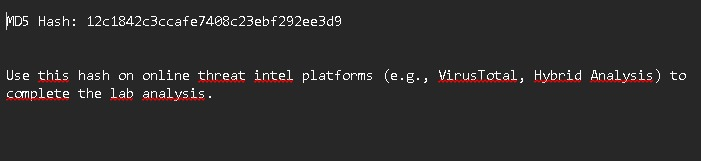
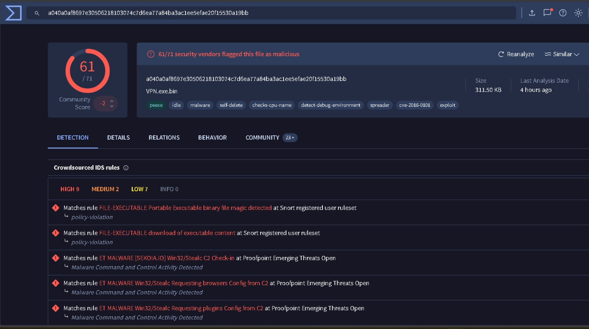
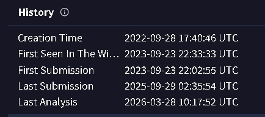
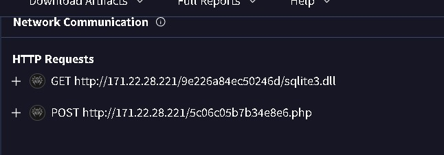
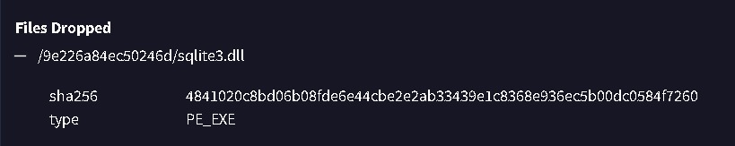
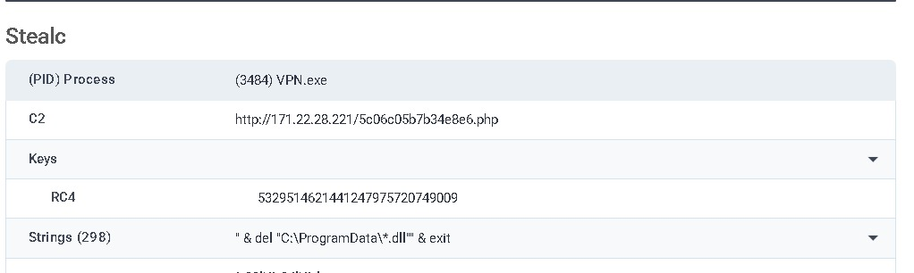
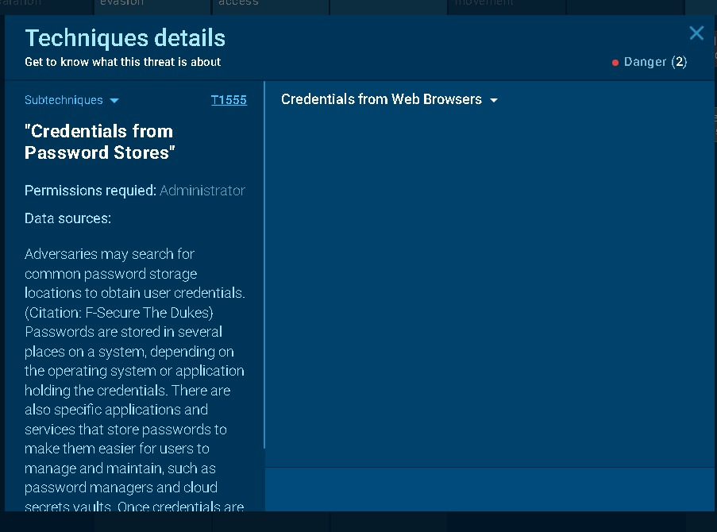
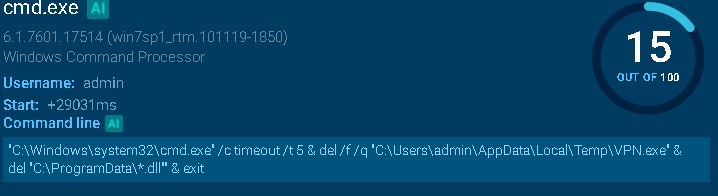
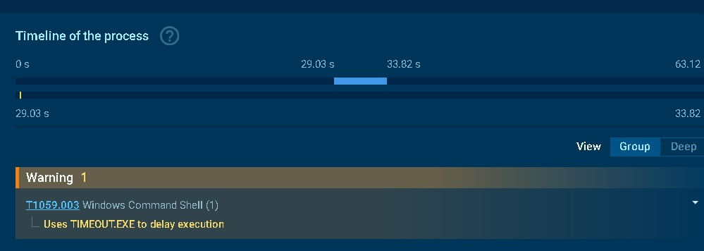

# Oski — CyberDefenders
## Category
Threat Intel

## Scenario
The accountant at the company received an email titled "Urgent New Order" from a client late in the afternoon. When he attempted to access the attached invoice, he discovered it contained false order information. Subsequently, the SIEM solution generated an alert regarding downloading a potentially malicious file. Upon initial investigation, it was found that the PPT file might be responsible for this download. Could you please conduct a detailed examination of this file?

## Tools Used
- virustotal(site)
- Any.run (site)

## Walkthrough

### Q1 — Determining the creation time of the malware can provide insights into its origin. What was the time of malware creation?
**What I did:**j'ai visité le site <virustotal> en mettant le hash donné,pour trouver des informations sur le hash je me suis dirigé vers details tab .

**What I found:**dans detail tab j'ai trouvé la section History qui contenait la date de création.
**Answer:**2022-09-28 17:40

### Q2 — Identifying the command and control (C2) server that the malware communicates with can help trace back to the attacker. Which C2 server does the malware in the PPT file communicate with?
**What I did:**la communication C2 étant un comportement réseau, j'ai consulté le tab Behavior.
**What I found:**dans ce tab, j'ai identifié le serveur avec lequel le malware communiquait.

**Answer:**POST http://171.22.28.221/5c06c05b7b34e8e6.php
NOTE: le malware se trouve dans la machine locale pour un reverse shell la méthode la plus logique sera POST pour effectuer une communication .

### Q3 — Identifying the initial actions of the malware post-infection can provide insights into its primary objectives. What is the first library that the malware requests post-infection?
**What I did:**pour trouver cette information je suis resté dans le même tab, car le téléchargement de fichiers sur la machine constitue également un comportement du malware
**What I found:**dans ce tab, plus précisément dans la section Files Dropped, on trouve le fichier téléchargé

**Answer:**sqlite3.dll

### Q4 — By examining the provided Any.run report, what RC4 key is used by the malware to decrypt its base64-encoded string?
**What I did:**le lien proposé par cyberdefender me redirige vers le report fait sur any.run
**What I found:**dans la section stealc j'ai trouvé la clé .

**Answer:**5329514621441247975720749009

### Q5 — By examining the MITRE ATT&CK techniques displayed in the Any.run sandbox report, identify the main MITRE technique (not sub-techniques) the malware uses to steal the user’s password.
**What I did:**le lien me redirige vers la page d'accueil du report .pour voir les techniques MITRE ATT&CK j'accède au MITRE ATT&CK Matrix en cliquant sur le bouton ATT&CK sous les indicators et trackers
**What I found:**j'ai trouvé toutes les techniques utilisées lors de cette attaque, l'une d'elles était "Credentials from Password Stores".

**Answer:**T1555

### Q6 — By examining the child processes displayed in the Any.run sandbox report, which directory does the malware target for the deletion of all DLL files?
**What I did:**dans la page d'accueil j'ai trouvé une petite arbre de processus.la commande responsable de la suppression des traces du malware était exécutée par cmd.exe le processus fils du VPN.exe
**What I found:**j'ai trouvé une commande exécutée par cmd.exe qui ciblait suppression d'un répertoire spécifique.

**Answer:**C:\ProgramData

### Q7 — Understanding the malware's behavior post-data exfiltration can give insights into its evasion techniques. By analyzing the child processes, after successfully exfiltrating the user's data, how many seconds does it take for the malware to self-delete?
**What I did:**pour déterminer le délai avant la suppression du malware j'ai poursuivi l'arbre de processus en cliquant sur le processus timeout, puis sur more info.
**What I found:**j'ai trouvé une représentation du timeline de ce dernier.

**Answer:** 5

## Incident Timeline
- t=0 ms  : l'exécution du fichier malveillant à cause d'une tentative de phishing réussie
- t=31 ms : la vérification du language prise en charge sur la machine par le malware
- t=343 ms : la lecture du nom de la machine par le malware
- t=359 ms : la lecture des informations sur le proxy server sur l'internet settings
- t=437 ms : la lecture de la machine GUID d'après les registres
- t=750 ms : la lecture de variabales d'environnement
- t=750 ms : la lecture des informations de CPU
- t=750 ms : la lecture de la version Windows de la machine local
- t=750 ms : la recherche du logiciel installé Adobe Flash Player 32 ActiveX
- t=1703 ms : la création du fichier <C:\Users\admin\AppData\Local\Google\Chrome\User Data\Local State>
- t=1781 ms : la creation du fichier <C:\ProgramData\GCBGCAFIIECBFIDHIJKFBAKEGD>
- t=3593 ms : le remplissage du fichier <C:\ProgramData\GDHIIDAFIDGCFHJJDGDA> avec des credentials 
- t=4289 ms : la demande de l'établissement d'une connexion avec une requête <http://171.22.28.221/5c06c05b7b34e8e6.php> de méthode POST par le processus <C:\Users\admin\AppData\Local\Temp\VPN.exe>
- t=4290 ms : the stealc communication was detected
- t=4309 ms : l'établissement d'une connexion externe avec le processus <C:\Users\admin\AppData\Local\Temp\VPN.exe> ,  IpDst:171.22.28.221 ,IpSrc:192.168.100.121 ,PortDst:80 ,PortSrc:49175
- t=4327 ms : la demande d'une requête de methode GET lors de la connexion établie <http://171.22.28.221/9e226a84ec50246d/sqlite3.dll> par le processus <C:\Users\admin\AppData\Local\Temp\VPN.exe>
- t=10359 ms : le malware stealc est détecté sur la RAM ( son exécution en RAM le rend indétectable par les antivirus basés sur l'analyse de fichiers)
- t=26468 ms : la création du fichier <C:\Users\admin\AppData\Roaming\Moonchild Productions\Pale Moon\profiles.ini>
- t=27723 ms : téléchargement du fichier <C:\ProgramData\mozglue.dll> (utilisé pour déchiffrer les mots de passes chiffrés et sauvgardés sur FireFox)
- t=29031 ms : le processus <C:\Windows\System32\cmd.exe> a excuté la commande <"C:\Windows\system32\cmd.exe" /c timeout /t 5 & del /f /q "C:\Users\admin\AppData\Local\Temp\VPN.exe" & del "C:\ProgramData\*.dll"" & exit>

## What I Learned
- le vpn.exe contenait un malware stealc dont le fonctionnement se caractérise par la collecte de credencials sans compter l'auto-suppression pour effacer ses traces
- stealc a été développé par un russophone qui l'a proposé comme un service par abonnement pour des entités externes dont le seul objectif est de récolter les informations personnelles 
- Certains malwares s'exécutent uniquement sur la RAM pour éviter la détection par les anti-virus
- FireFox utilise un chiffrement des mots de passes en utilisant la librairie mozglue.dll qui est dépendante 
