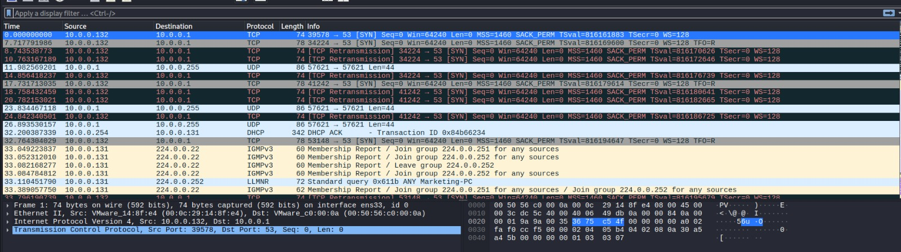
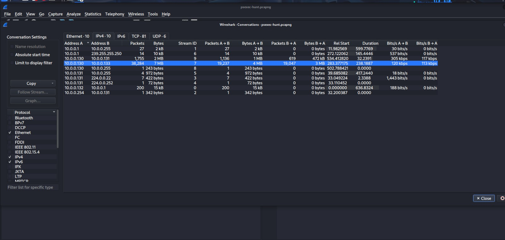
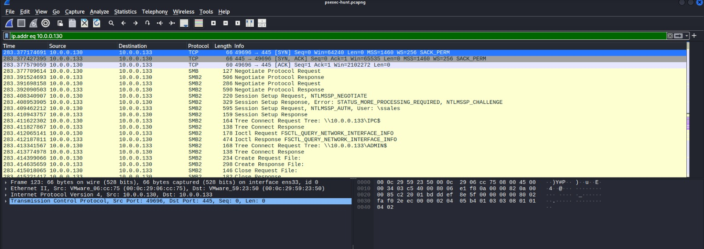
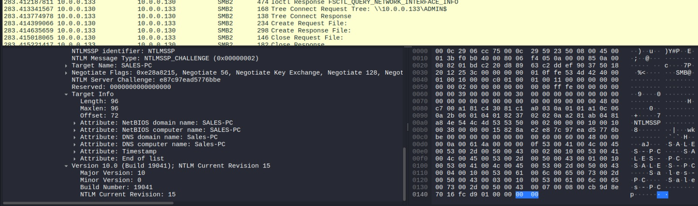
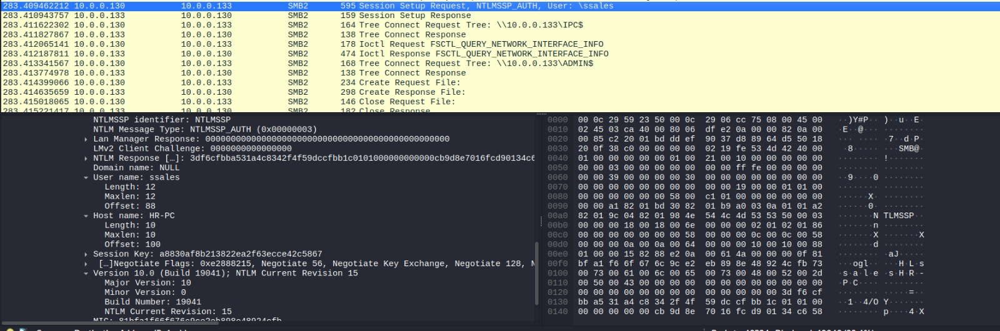
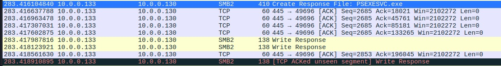
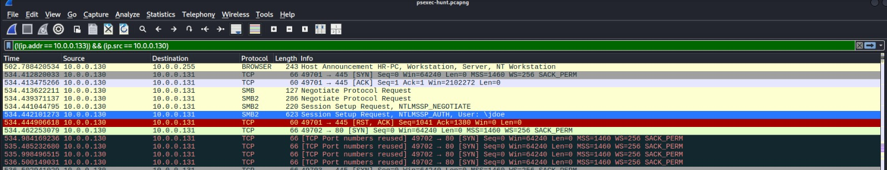

# PsExec Hunt Lab

## Category
Network Forensics

## Scenario
 An alert from the Intrusion Detection System (IDS) flagged suspicious lateral movement activity involving PsExec. This indicates potential unauthorized access and movement across the network. As a SOC Analyst, your task is to investigate the provided PCAP file to trace the attacker’s activities. Identify their entry point, the machines targeted, the extent of the breach, and any critical indicators that reveal their tactics and objectives within the compromised environment.

## Tools Used
 -Wireshark

## Walkthrough

### Q1 — To effectively trace the attacker's activities within our network, can you identify the IP address of the machine from which the attacker initially gained access?

 

**What I did:** j'ai sélectionné le fichier.pcap sur wireshark pour l'analyser en matière de précision.par ailleurs, je me suis accédé à la section conversations où toutes les activités du trafique sont résumé par les ip ,mac et aussi la taille ...
**What I found:** j'ai trouvé deux communications contenaient les plus grandes tailles .ces derniers avait un ip en commun de ce fait pour vérifier si cet ip appartient à l'attaqueur j'ai utilisé un filtre **ip.addr eq IP** de sorte que je vérifie si cet IP est le responsable du premier paquet tcp SYN dans la conversation.
**Answer:** 10.0.0.130

### Q2 — To fully understand the extent of the breach, can you determine the machine's hostname to which the attacker first pivoted?

**What I did:** il convient de noter qu'on a l'IP de l'attaquant qui est un ip interne .dès-lors, j'ai utilisé cet indicateur dans le filtrage du traffique.
**What I found:** le trafique filtré contenaient plusieurs paquets qui mettent en exergue une tentative de connection en utilisant le protocol smb. un paquet parmi ces derniers contenait quelque informations d'identification.
**Answer:** Sales-PC

### Q3 — Knowing the username of the account the attacker used for authentication will give us insights into the extent of the breach. What is the username utilized by the attacker for authentication?

**What I did:** on utilisant la section info et section ip source sur wireshark, j'ai pu déterminer quel paquet contenait les informations d'identifiant utilisés par l'attaqueur
**What I found:** en examinant le paquet en particulier la section de **smb2 header** j'ai trouvé le hostname sans compter l'identifiant d'authentification.
**Answer:** ssales

### Q4 — After figuring out how the attacker moved within our network, we need to know what they did on the target machine. What's the name of the service executable the attacker set up on the target?

**What I did:** pour traquer les activités de l'attaqueur j'ai filtré le trafique en utilisant l'IP de la machine pivotée par l'attaqueur.
**What I found:** d'après la section info sans oubliant l'examination de la section smb2 dans le paquet ,j'ai trouvé le nom du fichier executable créer.
**Answer:** psexesvc.exe

### Q5 — We need to know how the attacker installed the service on the compromised machine to understand the attacker's lateral movement tactics. This can help identify other affected systems. Which network share was used by PsExec to install the service on the target machine?

**What I did:** alors d'abord pour trouver le network share utilisé on doit savoir c'est quoi le share network .en matière de smb les networks shares sont comme des arbres qui pointe sur une partie de la memoire de la machine vive ou physique. 
**What I found:** dans le même dernier paquet de l'authentification en particuler la section tree j'ai trouvé le réseau utilisé pour accéder to installer Psexec
**Answer:** ADMIN$ (pointe sur le disque dur où se trouve l'arbre C:\Window\)

### Q6 — We must identify the network share used to communicate between the two machines. Which network share did PsExec use for communication?

**What I did:** les plus networks shares communes dans les systèmes sont **ADMIN$,IPC$,C$,D$** j'ai utilisé la chronologie du trafique filtré sans compter la section **info** .
**What I found:** j'ai trouvé plusieurs paquets de smb.par ailleurs, j'ai essayé de comprendre la chronologie des paquets smb dont les premiers étaient pour la vérification de communication en smb ensuite les paquets responsables pour l'authentification .dès-lors ,j'arrive à un paquet où l'attaqueur à essayer d'établir une communication logique avec la machine victime pour gérer les processus dans la mémoire vive sur la machine.
**Answer:** IPC$

### Q7 — Now that we have a clearer picture of the attacker's activities on the compromised machine, it's important to identify any further lateral movement. What is the hostname of the second machine the attacker targeted to pivot within our network?

**What I did:** pour trouver la deuxième tentative de pivotage, j'ai filtré le trafique on incluant l'IP de l'aataqueur sans compter l'exclusion l'IP de la première machine.
**What I found:** j'ai trouver des paquets de smb qui montre un établissement de communication entre de machine en utilisant le smb parmi ces deux machine c'est celle utilisée par l'attaquant.dès-lors ,j ai examiné le paquets où j'ai trouvé la deuxième machine
**Answer:** Marketing-PC

## Activity Timeline
 - t=283,377 |l'attaqueur initialise un connexion tcp par un paquet SYN en utilisant la machine de HR
 
 - t=283,393 |l'etablissement de la plus grande version commune de smb sans compter la signature numérique et l'algorithme de chiffrement utilisé par smb
 
 - t=283,408 | la demande et la réponse de ntlmssp par les informations d'identifiant pour être intégrées dans la génération du mots de passe 
 
 - t=283,409 | tentative avec succè d'authentification avec username **ssales**
 
 - t=283,411 | l'établissement avec smb2 une communication logique avec la machine ciblé en utilisant l'arbre IPC$
 
 - t=283,413 | l'accès à l'arbre ADMIN$ sur le disque dur
 
 - t=283,416 | la création du fichier **PSexesvc.exe** sur l'arbre ADMIN$ afin de bénificier des privilèges
 
 - t=283,417 | la transmission du code vers le fichier **Psexesvc.exe**
 
 - t=283,419 | la demande d'informations concernant le fichier **Psexecsvc.exe**
 
 - t=534,442 | la tentative du pivotage vers une nouvelle machine **Marketing-pc** avec user **jdoe** qui est échouée par la suite
 
 - t=536,505 | deuxième tentative avec succès d'authentification sur la même  machine avec user **IEuser**
 
 - t=536,507 | l'accès à l'arbre ADMIN$ dans la machine **Marketing-pc** 
 
 - t=536,511 | la création du fichier **psexesvcexe** sur la machine **Marketing-pc**

## What I Learned
 - j'ai appris que le protocol smb est un protocol de transmission des données sur un réseau local .par ailleurs, afin d'assurer la sécurité lors de l'utilisation de ce protocol il faut utiliser un protocol d'authentification comme ntlm sans compter la configuration du pare-feu pour assurer aucune appareil externe aura accès à ce protocol .
 - au niveau de l'attaqueur il est utile d'utiliser la première réponse du ntlm pour la collection des hostnames.
 - restricter l'accès aux autres machines en utilisant smb sera outil en matière du moindre privilèges de sorte que le pivotage d'un attaquant sur un réseau soit limité
 - dans les networks shares ADMIN$ est très utilisé pour la transmission des fichiers binaire (.exe) en revanche l'arbre IPC$ est utilisé pour le contrôle à distance

 
