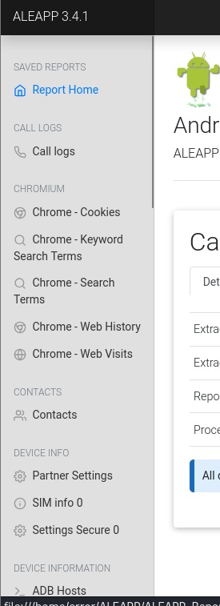
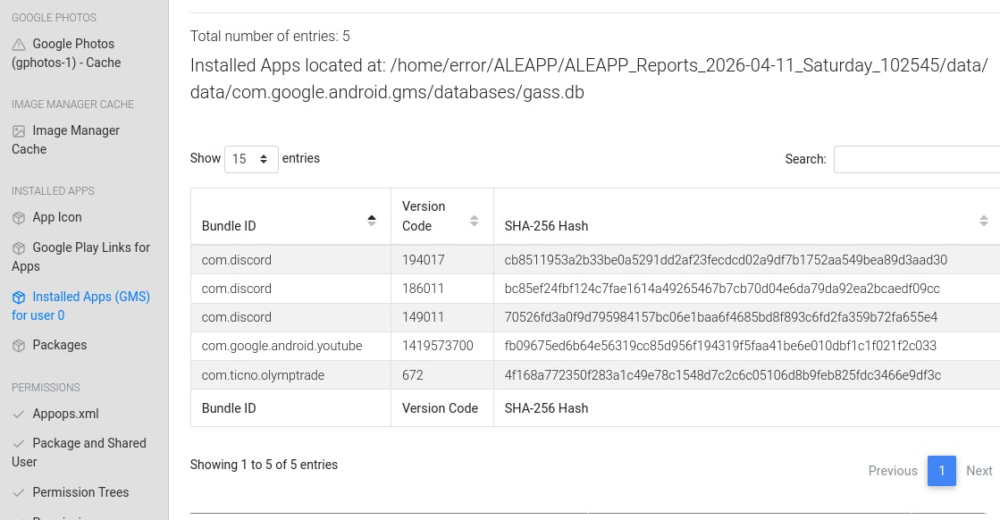
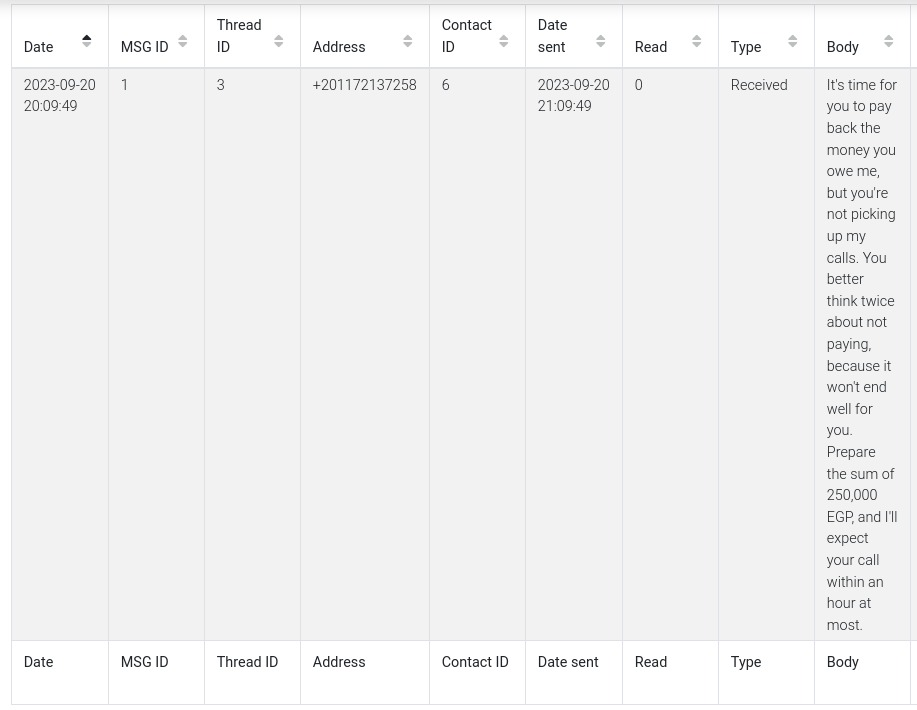
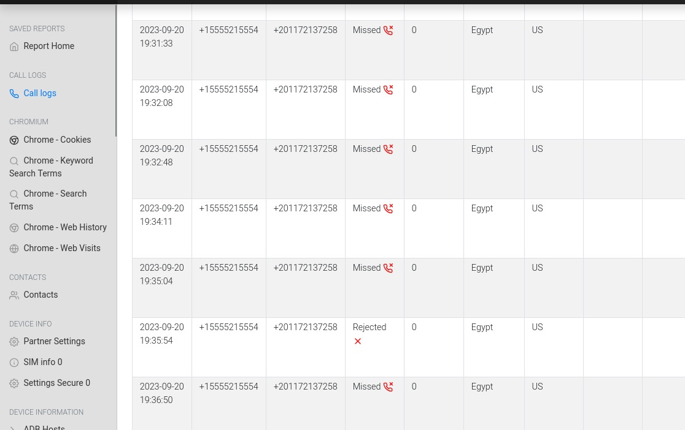
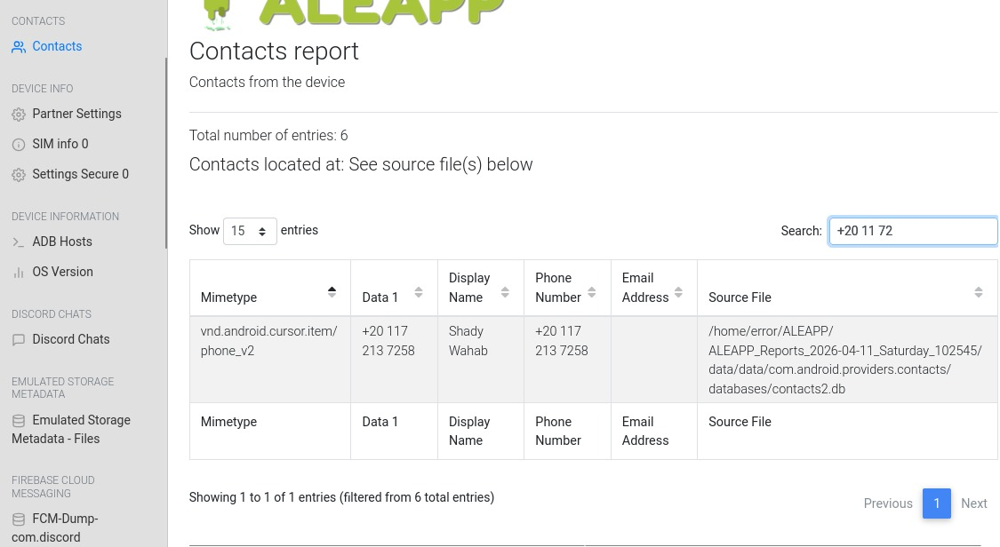
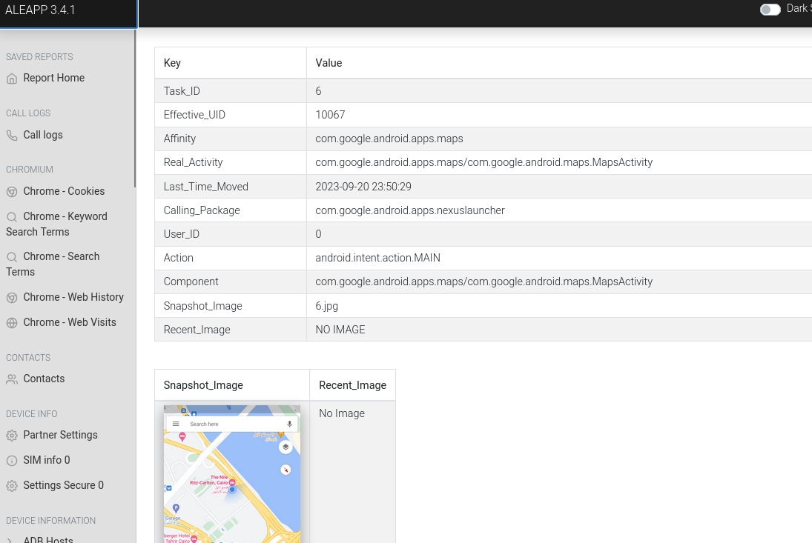
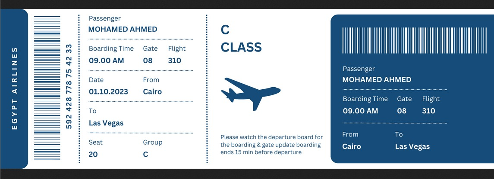
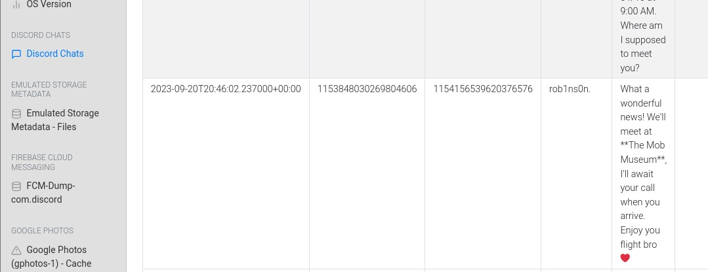

# The Crime Lab

## Category
Endpoint Forensics

## Scenario
We're currently in the midst of a murder investigation, and we've obtained the victim's phone as a key piece of evidence. After conducting interviews with witnesses and those in the victim's inner circle, your objective is to meticulously analyze the information we've gathered and diligently trace the evidence to piece together the sequence of events leading up to the incident.

## Tools Used
- ALEAPP

## Walkthrough

### Q1 — Based on the accounts of the witnesses and individuals close to the victim, it has become clear that the victim was interested in trading. This has led him to invest all of his money and acquire debt. Can you identify the SHA256 of the trading application the victim primarily used on his phone?

**What I did:Après mon accès aux rapports générés par ALEAPP,j'ai commencé par naviguer entre les sections du rapport de sorte que j'ai acquis une compréhension approfondie sur sa structure.dès-lors, j'ai trouvé la section des applications.

**What I found:**la section "Installed APPS" contenait trois sous section dont l'un d'elles avait un tableau des application installées par google play store (gms).

**Answer:**4f168a772350f283a1c49e78c1548d7c2c6c05106d8b9feb825fdc3466e9df3c.

### Q2 — According to the testimony of the victim's best friend, he said, "While we were together, my friend got several calls he avoided. He said he owed the caller a lot of money but couldn't repay now". How much does the victim owe this person?
 

**What I did:**le rapport avait deux sous-sections pour les messages venant d'app de communication.j'ai commencé par la recherche dans la sous-section "Discord Chats" ,ensuite je me suis engagé  avec la deuxième sous section "Sms messsages".

**What I found:**ce dernier contentait un seule message qui parlait du prêt.

**Answer:**250 000 (EGP).

### Q3 — What is the name of the person to whom the victim owes money?

**What I did:**il convient de noter que les témoignages soulignent que le prêteur a appelé plusieurs fois.dès-lors, j'ai vérifié la section "Call Logs" pour voir le numéro du prêteur de ce fait j'ai remarqué  le numéro qui se répète plusieurs fois sans aucune réponse "+20 11 72 13 72 58".

**What I found:**j'ai utilisé le numéro trouvé afin de filtrer les contacts de la victime.

**Answer:**Shady Wahab.

### Q4 — Based on the statement from the victim's family, they said that on September 20, 2023, he departed from his residence without informing anyone of his destination. Where was the victim located at that moment?

**What I did:**Pour tracer l'activité de la victime j'ai utilisé la section "Recent Activity".

**What I found:**j'ai trouvé un tableau qui contenait la même date demandée avec un screenshot de google maps .

**Answer:**The Nile Ritz-Carlton.

### Q5 — The detective continued his investigation by questioning the hotel lobby. She informed him that the victim had reserved the room for 10 days and had a flight scheduled thereafter. The investigator believes that the victim may have stored his ticket information on his phone. Look for where the victim intended to travel.

**What I did:**j'ai commencé par l'inspection de sous section "recent activity" qui contenait pas les activités faites à la date designée. par ailleurs ,j'ai trouvé une photo numérique d'un billet d'avion dont le départ est egypt à cairo ce qui implique la ville où  se trouvait la victime. 

**What I found:**ce billet contenait la destination recherchée avec la date qui renforce totalement le témoignage du lobby (1.10.2023).

**Answer:**Las Vegas.

### Q6 — After examining the victim's Discord conversations, we discovered he had arranged to meet a friend at a specific location. Can you determine where this meeting was supposed to occur?

**What I did:**j'ai accédé à la sous-section "discord Chats" pour chercher le message convenable.

**What I found:**j'ai trouvé un message de "rob1ns0n" à "20.09.2023" qui contenait le lieu du rendez-vous.

**Answer:**The Mob Museum.

## Activity Timeline
 - t=2023.09.20 00:57:26 |la notification faite par la victime avec le surnom "infern0_o"au destinataire "rob1" sur discord concernant la modification du billet de vol (pour le 2023.1.10 à 9:00 AM vers LasVegas).
 - t=2023.09.20 19:45:00 - 19:31:33 |la victime reçoit des appels du prêteur.
 - t=2023.09.20 20:09:49 |la victime reçoit des messages sms provenant du prêteur.
 - t=2023.09.20 20:15:22 - 23:51:02 |la recherche par la victime sur Google à propos des billets d'avion.
 - t=2023.09.20 20:46:02| la réponse de "rob1ns0n" sur discord qui contenait le lieu du rendez-vous (The Mob Museum)
 - t=2023.09.20 23:50:29 | "le Nile Ritz-Carlton" l'hotel où se trouvait la victime.
 - t=2023.10.01 09:00:00 | le départ du vol de la victime de cairo (EGYPT) vers Las Vegas.

## What I Learned
 - j'ai appris que ALEAPP est un outil d'analyse qui peut analyser et extraire des informations du disque d'android tout en classant ces derniers.
 - l'utilisation d'un navigateur privé est essentielle pour protéger ta vie privée sans compter les logiciels de chiffrement pour les disques dur pour éviter la collection des données.
