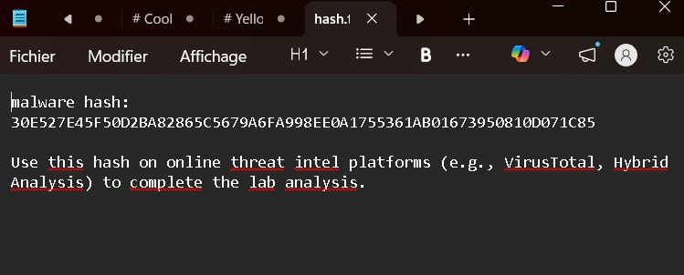
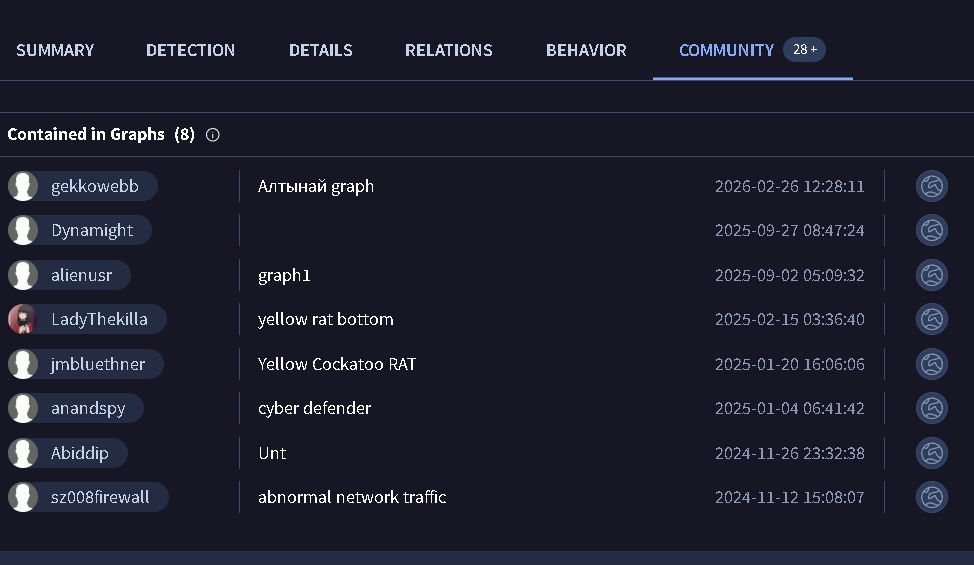
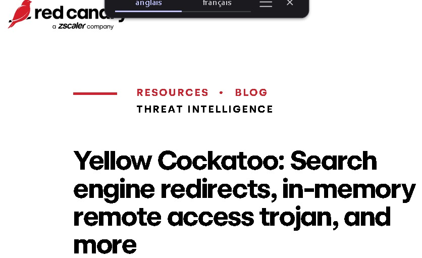
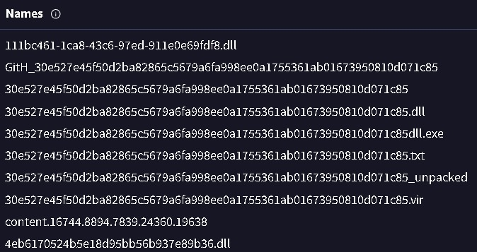
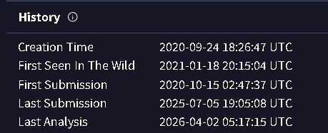
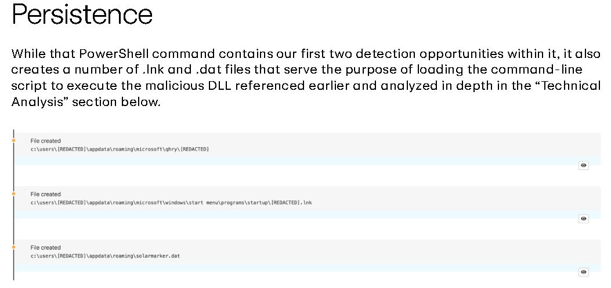
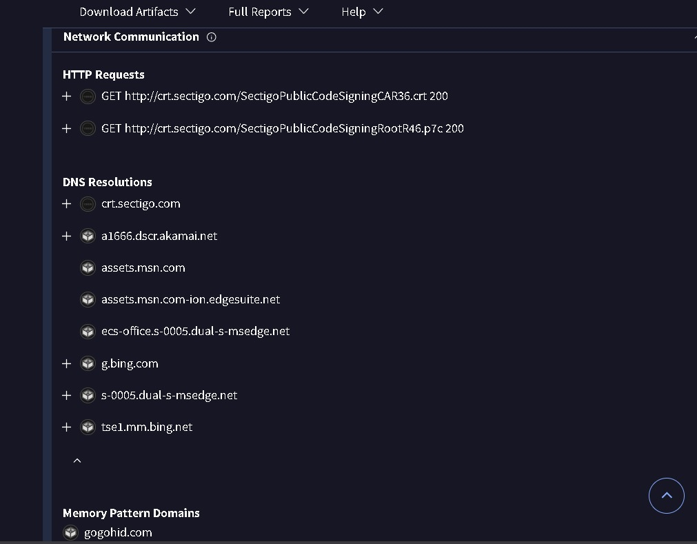

# Yellow Rat — CyberDefenders

## Category
threat intel

## Scenario
During a regular IT security check at GlobalTech Industries, abnormal network traffic was detected from multiple workstations. Upon initial investigation, it was discovered that certain employees' search queries were being redirected to unfamiliar websites. This discovery raised concerns and prompted a more thorough investigation. Your task is to investigate this incident and gather as much information as possible.

## Tools Used
- virus total
- online reports

## Walkthrough

### Q1 — Understanding the adversary helps defend against attacks. What is the name of the malware family that causes abnormal network traffic?

**What I did:j'ai premièrement accédé au fichier donné au dessus du scénario .par ailleus, j'ai utilisé le hash donné pour trouver la famille du malware .la connaissance de la famille du malware en resulte que la protection et les méthodes de deétection contre ce dernier soient efficaces.

**What I found:**les tabs de virus total ne montre pas la famille du malware sauf le tab communauté .du fait que les résultats soient précises ,je me suis dirigé pour chercher dans un report du REDCANARY où j'ai trouvé la même catégorie.

**Answer:**Yellow Cockatoo Rat

 

### Q2 — As part of our incident response, knowing common filenames the malware uses can help scan other workstations for potential infection. What is the common filename associated with the malware discovered on our workstations?

**What I did:**il importe de souligner que la connaissance du nom de fichier malware pourra facilité la recherche de ce dernier dans différentes stations.j'ai utilisé le hash de sorte que je trouve plus d'information concernant le nom du fichier.

**What I found:**dans details tab ,plus spécifiquement names section plusieurs noms que ce malaware l'utilise lors des attaques mais j'ai choisi le premier plus qu'il est le plus commun.

**Answer:**111bc461-1ca8-43c6-97ed-911e0e69fdf8.dll

### Q3 — Determining the compilation timestamp of malware can reveal insights into its development and deployment timeline. What is the compilation timestamp of the malware that infected our network?

**What I did:**il covient de noter que le temps compilation soit une information critique comme mentionné ci-dessus.j'ai utilisè comme avant le site virstotal pour trouvé cette information.

**What I found:**je me suis accédé au tab details ,section History.

**Answer:**2020-09-24 18:26

### Q4 — Understanding when the broader cybersecurity community first identified the malware could help determine how long the malware might have been in the environment before detection. When was the malware first submitted to VirusTotal?

**What I did:**pour cette question virustotal sera notre support.chercher quand le malware est détecté la première fois répond à plusieurs question.

**What I found:**dans le tab details ,section history est où j'ai trouvé la date.

**Answer:**2020-10-15 02:47

### Q5 — To completely eradicate the threat from Industries' systems, we need to identify all components dropped by the malware. What is the name of the .dat file that the malware dropped in the AppData folder?

**What I did:**pour trouver les fichiers déposés ou plutôt créés par ce malware ,j'ai analyser plusieurs rapports en raison du changement dynamique de certains malwares quand ils détectent qu'ils se trouvent dans un sandbox. les résultats trouver correspondant à celle posé  par redcanary .

**What I found:**le plus commun fichier que ce répète dans ces rapports c'est le fichier qui se termine par .dat .

**Answer:**solarmarker.dat

### Q6 — It is crucial to identify the C2 servers with which the malware communicates to block its communication and prevent further data exfiltration. What is the C2 server that the malware is communicating with?

**What I did:**Pour moi trouver le c2 communication domain est très important ,ce IoC peut être utilisé comme loi de bloquage sur le firewall et aussi pour la détection d'autres connections sur d'autres machines en filtrant les logs etc...dans behavior tab sur virustotal ,la section Network Communication j'ai trouvé les https reuqest ,dns resolutions et memory pattern domains.

**What I found:**ces informations trouvés peuvent être trompeuses c'est pour ca je vais expliquer chacune ,d'après l'illustration si dessous les https request ce sont des légitimes urls prouvé par Vt lui même quand je les ai scanné donc la plus fiable information sera  memory pattern urls car c'est directement extrait de la ram du malware et on l'analysant sur vt j'ai trouvé que ce url n'est pas légitime.

**Answer:**https://gogohid.com
 

## Incident Timeline

  t=2020-09-24 18:26:47 UTC |le temps de compilation par le développeur du malware(risque du timestomping);
  t=2020-10-15 02:47:37 UTC |la première fois ce fichier a été téléchargé sur VT(virustotal);
  t=2021-01-18 20:15:04 UTC |la première fois où le malware a été détecté sur une machine;
  t=2025-07-05 19:05:08 UTC |la dernière fois ce fichier est sousmis sur virustotal;
  t=2026-04-02 05:17:15 UTC | la dernière fois le malware a été analysé sur un fichier par virustotal;

## What I Learned

-j'ai appris que les extensions ont différents rôles par exemples .dat est un fichier de données utilisé par les malwares pour éviter les détections.

- les fichiers .dll sont des bibliothèques contenant differents fonctions ou codes pour effectuer des tâches spécifiques en utilisant un processus,généralement utilisé pour éviter la détection (en tout cas le AV le considère suspect mais ne le priorise pas).
  
-la combinaison de ces fichiers sert spécifique pour la persistence mais c'est les registry key sont la plus importantes tâches dans cette chaîne du fait que ce dernier sert à executer des commandes ou processus lors du démarrage du l'ordinateur.
